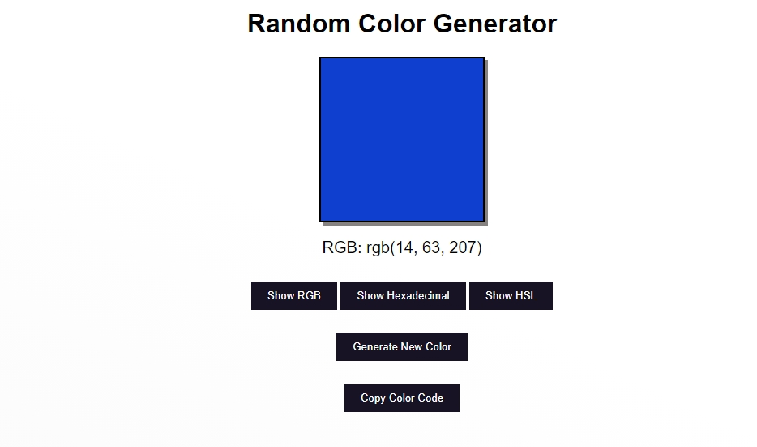

# Random Color Generator

A **Random Color Generator** application built using **HTML**, **CSS**, and **JavaScript**. This tool allows users to generate random colors and view their corresponding color codes in multiple formats.



## Features

- **Generate Random Colors**:
  - Click the "Generate New Color" button to display a random color.
- **Display Multiple Color Code Formats**:
  - View the color code in **RGB**, **Hexadecimal**, and **HSL** formats.
  - Toggle between the formats using the provided buttons.
- **Copy to Clipboard**:
  - Copy the displayed color code to the clipboard with a single click.
- **Interactive and Simple UI**:
  - Designed with a clean interface for a user-friendly experience.

## Installation

1. Clone the repository:
   ```bash
   git clone https://github.com/muaz64/Random-Color-Generator.git
   ```
2. Navigate to the project folder:
   ```bash
   cd Random-Color-Generator
   ```

## Usage

1. Open the `index.html` file in any modern browser.
2. Use the **Generate New Color** button to generate a random color.
3. Toggle between RGB, Hexadecimal, and HSL formats using the respective buttons.
4. Copy the color code by clicking **Copy Color Code**.

## File Structure

```
Random-Color-Generator/
├── index.html     # Main HTML file
├── style.css      # CSS file for styling
├── script.js      # JavaScript file for logic


## How It Works

1. **HTML**:
   - Provides the structure for the color display box, buttons, and color code text.
2. **CSS**:
   - Enhances the visual appearance with responsive and modern styling.
3. **JavaScript**:
   - Generates random colors in RGB format.
   - Converts RGB values to Hexadecimal and HSL formats for display.
   - Handles clipboard copying functionality.

### Example

Generated Color:  
- **RGB**: `rgb(14, 63, 207)`  
- **Hex**: `#0E3FCF`  
- **HSL**: `hsl(227, 88%, 43%)`

## Compatibility

This project is compatible with all modern browsers, including:
- Google Chrome
- Mozilla Firefox
- Microsoft Edge
- Safari

## License

This project is licensed under the **MIT License**. Feel free to use, modify, and distribute it.

## Contributions

Contributions are welcome! Here's how you can contribute:
1. Fork the repository.
2. Create a new branch with your feature or fix.
3. Submit a pull request with detailed changes.

---


Enjoy generating beautiful random colors! 🎨
```